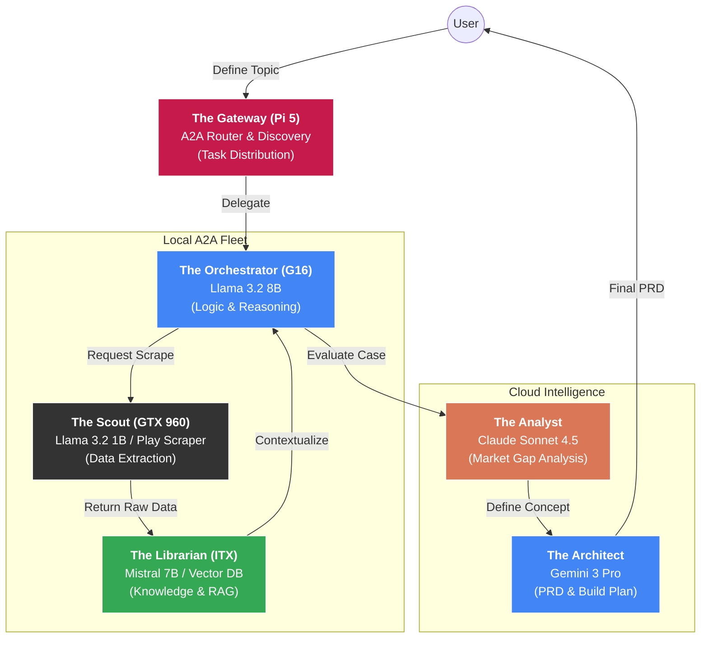

================================================================================
PROJECT: DISTRIBUTED A2A RESEARCH CLUSTER
FILE: README.md
================================================================================

# Scraper-Powered Multi-Agent Research Squad (A2A Distributed)

This project implements a Distributed Multi-Agent System (MAS) that leverages the **A2A Protocol** to automate product research, market gap analysis, and PRD generation across a heterogeneous compute cluster.

By offloading "grunt work" to local legacy hardware and "high-reasoning" to cloud models, the system optimizes for both cost and intelligence.

## Architecture

The system is decentralized. Instead of a single master script, each node acts as a specialist service communicating via **JSON-RPC 2.0**. A central Gateway (Pi 5) handles task routing based on hardware capability.

# Distributed A2A Fleet Overview

## The Fleet (Hardware & Roles)

| Node | Role | Hardware | Primary Model / Tool |
| :--- | :--- | :--- | :--- |
| **Gateway** | Task Routing / Discovery | Raspberry Pi 5 | A2A Router (FastAPI) |
| **Orchestrator** | Logic / Reasoning | ASUS ROG G16 | Llama 3.2 8B |
| **Librarian** | Context / RAG | Mini-ITX (RTX 3050) | Mistral 7B + ChromaDB |
| **Scout** | Web Scraping / Grunt Work | Desktop (GTX 960) | Llama 3.2 1B + Play Scraper |
| **Cloud Tier** | Synthesis & Final Design | AWS/Google/Anthropic | Claude 4.5 / Gemini 3 Pro |

---

## The Protocol: A2A (Agent-to-Agent)
All nodes adhere to the A2A communication standard to ensure the cluster remains modular and scalable.

* **Discovery**: Each node hosts an Agent Card at `/.well-known/agent.json` defining its capabilities (e.g., `web_scrape`, `vector_search`).
* **Communication**: Task requests and results are exchanged via **JSON-RPC 2.0** over HTTP.
* **Statelessness**: Workers are stateless; the **Orchestrator (G16)** maintains the session state, while the **Librarian (ITX)** maintains the long-term knowledge base.

---

## The Research Loop
1.  **Scout (GTX 960)**: Executes raw data extraction from the Google Play Store using custom scrapers.
2.  **Librarian (ITX)**: Cleans the data, generates embeddings, and stores them in a local vector database for rapid retrieval.
3.  **Orchestrator (G16)**: Queries the Librarian to identify trends and coordinates with the Cloud Tier for deep analysis.
4.  **Strategist (Cloud)**: Performs the final "Heavy Lifting"—identifying viable market gaps (**Claude 4.5**) and drafting the technical PRD (**Gemini 3 Pro**).

---

## Integration Notes
* **Networking**: All local nodes must be on the same subnet with static IP assignments or local DNS resolution (e.g., `scout.local`).
* **Security**: Internal A2A traffic is unauthenticated for performance, but the Gateway acts as the firewall for external requests.