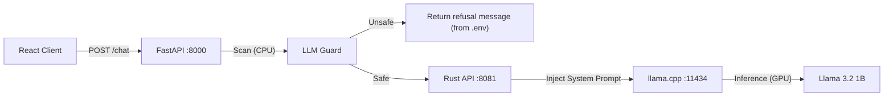

# Moving past chatbots: My Scraper-Powered Research Squad

Building a single AI chat interface is fine, but it’s basically just a glorified search bar. If the goal is to actually ship a product, you need a team that does the work needed while you’re still doing your day job to pay bills.

I’ve been messing with **Multi-Agent Systems (MAS)** in **Antigravity** lately. Instead of one big prompt, I’m building a squad of specialists. My current setup is a Research Agent that uses my **Google Play Scraper** tool to find the gaps in the market that are actually worth building for.

I went a few undocumented steps past this little pi 5 project and came out with a video card powered agent. [llama3.2-cuda-fastapi](https://github.com/J-Code-Sigma/llama3.2-i74790-gtx960-cuda-fastapi-rust-chat). I recycled the brains behind it for my research tool that's running as I type this.

### The Architecture

### The Stack
I'm keeping the overhead low by offloading the initial "grunt work" to local hardware:
- **The Scout:** I've augmented a version of this CUDA agent with a Google Play scraper tool [llama3.2-cuda-fastapi](https://github.com/J-Code-Sigma/llama3.2-i74790-gtx960-cuda-fastapi-rust-chat) setup. Even without the Rust layer, running Llama 3.2 via `llama-cpp` on my **GTX 960** gives me an unlimited, private research skill for the cost of electricity.
- **Claude Sonnet 4.5** for product determination.
- **Claude 4.5 Thinking** or **Gemini 3 Pro** for the final architectural calls.

### The Loop

First, the **Llama CUDA Research Agent** hits the Play Store. It uses my scraper skill (with a secret sauce) to find the details on these targeted apps. 

Next, then the **Analyst Agent(Claude Sonnet 4.5)** takes over. It digs through the scraper findings to determine a good product.

Finally, the **Architect Agent(Gemini 3 Pro)** drafts the ideal product's **PRD** and the build plan. 

### Conclusion
As someone who is pretty ADHD with projects, this is a massive cognitive multiplier. The agents handle the boring "Search-Analyze-Verify" loop so I can just focus on the architecture. 

The best part about doing this in Antigravity is the **state persistence**; I can walk away and pick up exactly where the squad left off. I only let the expensive model start writing the PRD once I’ve looked at the research and confirmed there’s actually a business there.

Chatting with an agent back and forth is old news. Building agents who work autonomously is where people who build things should be aiming.

