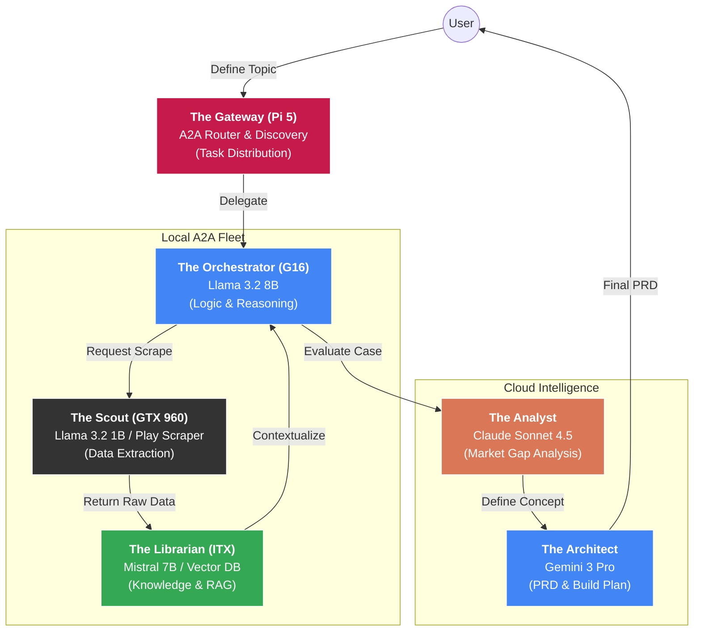

# Scraper-Powered Multi-Agent Research Squad (A2A Distributed)

This project implements a Distributed Multi-Agent System (MAS) that leverages the A2A Protocol to automate product research, market gap analysis, and PRD generation across a heterogeneous compute cluster.

## Architecture

The system is decentralized. Instead of a single master script, each node acts as a specialist service communicating via JSON-RPC 2.0. A central Gateway handles task routing based on hardware capability and current load.

### Scraper-Powered Research Squad Architecture

This diagram visualizes the updated "Loop": Local Scout -> Analyst -> Architect, distributed across the hardware fleet.

